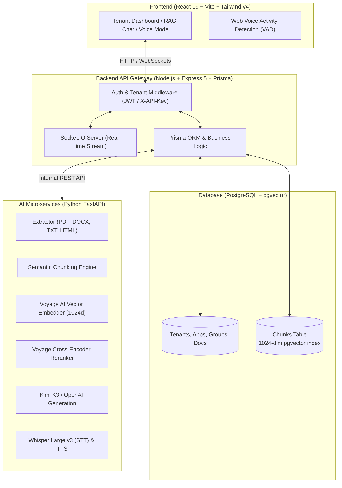

# VectorVault RAG Platform

Multi-tenant RAG and vector search platform with an interactive voice assistant. Python FastAPI microservices handle the AI workloads, a Node.js/Express gateway with PostgreSQL and pgvector enforces multi-tenancy, and a React 19 dashboard provides the UI.


---

## Summary

VectorVault RAG is a multi-tenant Retrieval-Augmented Generation platform: organizations can create isolated AI applications, ingest document corpora, run two-stage hybrid vector retrieval, and interact through text or voice.

Python microservices handle the compute-heavy AI tasks (embedding, reranking, transcription, LLM inference), while the Node.js/Prisma backend handles multi-tenancy, authorization, database access, and real-time WebSocket communication.

---

## Key features

- **Multi-tenant architecture** — data isolation across tenants, applications (`apps`), document corpora (`groups`), and vector chunks. Supports JWT session auth and `X-API-Key` programmatic access.
- **Two-stage hybrid RAG pipeline** — first-stage vector search via PostgreSQL `pgvector` (1024-dim Voyage AI embeddings), second-stage reranking via the Voyage cross-encoder reranker.
- **Full-duplex voice assistant** — voice activity detection, Whisper Large v3/Turbo speech-to-text, LLM response generation, and TTS synthesis.
- **Decoupled Python AI microservices** — FastAPI services for text extraction, chunking, embeddings, reranking, LLM generation (Kimi K3 and OpenAI), and translation.
- **Real-time pipeline visualizer** — UI components showing document extraction, chunking, embedding, and indexing as they happen.
- **Frontend** — React 19, Vite, Tailwind CSS v4, with WebGL/Canvas shader animations for voice mode.

---

## Screenshots

_Add screenshots/GIFs here before sharing this repo._

| Dashboard / Corpora Manager | RAG Chat Interface |
| :---: | :---: |
| _add screenshot_ | _add screenshot_ |

| Voice Assistant Mode | Data Pipeline Visualizer |
| :---: | :---: |
| _add screenshot_ | _add screenshot_ |

---

## Architecture



---

## Tech stack

| Layer | Technologies |
| :--- | :--- |
| Frontend | React 19, Vite 8, Tailwind CSS v4, TanStack React Query, React Router v7, React Syntax Highlighter, Lucide Icons |
| Backend gateway | Node.js, Express v5, Prisma ORM, Socket.IO, Zod validation, Better Auth / JWT, Multer |
| Database | PostgreSQL, `pgvector` (1024-dim vector similarity indexing), raw SQL for vector queries |
| AI microservices | Python 3.10+, FastAPI, Uvicorn, Pydantic, PyMuPDF, Trafilatura, python-docx/pptx |
| AI providers | Embeddings: Voyage AI (`voyage-3-lite`); reranker: Voyage Reranker; LLM: Kimi K3, OpenAI GPT; speech: Whisper Large v3/Turbo, custom TTS |

---

## Repository structure

```
vector_valut-RAG/
├── microservices/                  # Python FastAPI AI microservices
│   ├── server.py                   # Main FastAPI server entry point
│   └── app/
│       ├── api/                    # Microservice routers (chunking, embedding, reranking, generation, voice)
│       ├── models/                 # Pydantic request/response schemas
│       ├── providers/              # Integration with Voyage AI, Kimi K3, OpenAI, Whisper
│       └── services/               # Text-to-speech & translation helpers
└── vector_valut/
    ├── backend/                    # Node.js Express & Prisma API gateway
    │   ├── app/
    │   │   ├── server.js           # Express server entry point
    │   │   ├── socket.js           # Socket.IO real-time event handlers
    │   │   └── src/
    │   │       ├── controllers/    # App, tenant, RAG ingestion, retrieval, voice controllers
    │   │       ├── middleware/     # Auth (JWT verification & X-API-Key validation)
    │   │       └── utility/        # HTTP client helpers communicating with microservices
    │   ├── prisma/
    │   │   └── schema.prisma       # Prisma multi-tenant data model with pgvector
    │   └── multi-tenant-schema.md  # Multi-tenant isolation specifications
    └── frontend/
        └── app/                    # React 19 frontend dashboard
            └── src/
                ├── components/     # Chat interface, voice mode shaders, file uploaders
                ├── pages/          # Dashboard, Corpora Manager, RAG Chat, Voice Assistant
                └── apis/           # Axios client modules
```

---

## RAG data flow

### Document ingestion & vector indexing
1. **Upload** — user uploads files (PDF, DOCX, TXT) via the Corpora Manager UI.
2. **Extraction** — the Python extraction microservice pulls raw text and metadata.
3. **Chunking** — raw text is split into structured segments.
4. **Embedding** — chunks are converted into 1024-dimensional Voyage AI vectors.
5. **Storage** — chunks, metadata, and vectors are saved in PostgreSQL via `pgvector`.

### Two-stage retrieval & answer generation
1. **Query embedding** — the user's question is converted into a 1024-dim vector.
2. **Candidate retrieval** — PostgreSQL runs cosine similarity search (`<=>`) scoped by `tenantId`, `appId`, and `groupId`, returning top candidates (e.g. top 20).
3. **Reranking** — candidates are scored by the Voyage reranker and filtered to the top K (e.g. top 5).
4. **Generation** — the reranked context is passed to Kimi K3 (or OpenAI) to produce a grounded answer with citations.

---

## Voice assistant

- Client-side voice activity detection (VAD) monitors speech in real time.
- Audio is streamed via WebSockets/REST to the Python transcription microservice.
- Speech-to-text via Whisper Large v3/Turbo.
- The transcribed prompt feeds the RAG pipeline; the response is converted back to speech via TTS.
- A GLSL canvas shader animates listening/processing/speaking states.

---

## Multi-tenant isolation model

| Level | Isolation mechanism |
| :--- | :--- |
| Tenant | `Tenant` record with a dedicated UUID; every table stores a `tenantId`. |
| App | `App` record scoped to a tenant, allowing multiple bots (e.g. HR Bot, Support Bot) per tenant. |
| Corpus (Group) | `Group` record scoping document sets to specific applications. |
| API auth | JWT for dashboard routes; `X-API-Key` for external query/upload endpoints. |

---

## Getting started

### Prerequisites
- Node.js v18+ or Bun
- Python 3.10+
- PostgreSQL 15+ with the `pgvector` extension
- Voyage AI API key and OpenAI API key (or NVIDIA-hosted Kimi K3)

### Required API keys

| Key | Purpose | Required |
| :--- | :--- | :--- |
| `VOYAGE_API_KEY` | Embeddings & reranking | Yes |
| `OPENAI_API_KEY` | LLM answer generation | Yes (or `NVIDIA_API_KEY`) |
| `NVIDIA_API_KEY` | LLM generation via Kimi K3 | Alternative to OpenAI |
| `RAG_SERVICE_API_KEY` | Shared secret between the gateway and Python microservices | Yes |
| `GROQ_API_KEY` | Voice assistant text-to-speech | Voice mode only |
| `GOOGLE_CLIENT_ID` / `GOOGLE_CLIENT_SECRET` | Google OAuth login | Google sign-in only |

Get keys from [Voyage AI](https://www.voyageai.com/), [OpenAI](https://platform.openai.com/), [NVIDIA NIM](https://build.nvidia.com/), and [Groq](https://console.groq.com/).

### 1. Python AI microservices

```bash
cd microservices

# Create virtual environment
python3 -m venv venv
source venv/bin/activate

# Install dependencies
pip install -r requirements.txt

# Configure environment
cp .env.example .env   # Fill in VOYAGE_API_KEY, OPENAI_API_KEY, RAG_SERVICE_API_KEY, etc.

# Start FastAPI server
python3 server.py
# Server runs at http://localhost:8000
```

### 2. Backend gateway

```bash
cd vector_valut/backend

npm install
cp .env.example .env   # Fill in DATABASE_URL, JWT_SECRET_KEY, RAG_SERVICE_API_KEY, etc.

npx prisma migrate dev

npm run dev
# Backend runs at http://localhost:5000
```

### 3. Frontend dashboard

```bash
cd vector_valut/frontend/app

npm install
npm run dev
# Frontend runs at http://localhost:5173
```

---

## Design decisions & trade-offs

- **Two-stage retrieval instead of vector search alone** — raw cosine similarity over-fetches semantically similar but contextually weak matches. A cross-encoder reranker as a second pass trades a small latency cost for better precision on the chunks that reach the LLM.
- **Raw SQL for vector queries** — Prisma's query builder doesn't support `pgvector`'s `<=>` distance operator natively, so retrieval queries use raw SQL while the rest of the app (tenant/app/group CRUD) stays on the Prisma ORM.
- **Python microservices split from the Node gateway** — extraction, chunking, and calls to embedding/reranking/transcription/LLM providers benefit from Python's ML tooling, while the gateway's job (auth, tenancy, orchestration, WebSockets) is I/O-bound and better served by Node's event loop. Splitting them lets each scale independently.
- **Tenant → App → Group hierarchy** — modeled on multi-tenant SaaS needs: one tenant can run several distinct bots, each with its own isolated document corpus, instead of flattening everything under a single tenant-level namespace.

---

## Contact

- Developer: Mahesh N
- Email: [maheshnmahesh567@gmail.com](mailto:maheshnmahesh567@gmail.com)
- Repository: [VectorVault RAG Platform](https://github.com/maheshn567/vector-vault-rag)
